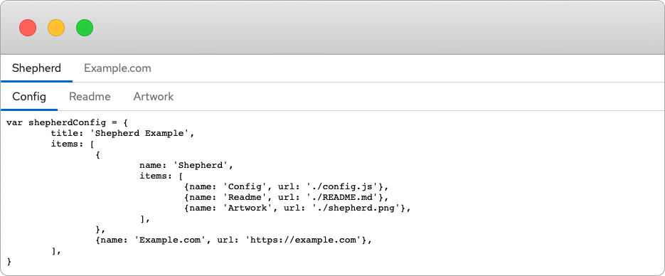

# Shepherd

> Herd the scattered and disparate tools and pages under a common interface.

Shepherd is a single-page application with a configurable hierarchical tabbed navigation that loads pages inside itself in an `iframe`.

It is but to scratch an itch with a load of dangling intranet pages that needed consolidation.




Images:

https://hub.docker.com/repository/docker/famousgarkin/shepherd

Usage:

```sh
docker run --rm -v "$PWD/config.js:/app/dist/config.js" -p 80:80 famousgarkin/shepherd
```
